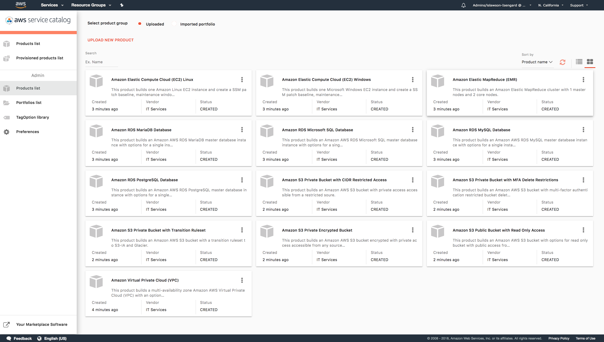

# AWS Service Catalog Reference Architecture

[AWS Service Catalog](https://docs.aws.amazon.com/servicecatalog/latest/adminguide/introduction.html) allows you to centrally manage commonly deployed AWS services, and helps you achieve consistent governance which meets your compliance requirements, while enabling users to quickly deploy only the approved AWS services they need. 

This guide will help you deploy and manage your AWS ServiceCatalog using Infrastructure as Code (IaC).
 Read the [User Guide](https://docs.aws.amazon.com/AWSCloudFormation/latest/UserGuide/cfn-reference-servicecatalog.html)
 for the full documentation on ServiceCatalog and CloudFormation.  

The portfolio templates in each section will create a ServiceCatalog Portfolio with various products,
 a launch constraint and linked roles for provisioning.  
*You must create the IAM end user group and policy stack from the IAM section before launching any portfolio templates.
 * [IAM Templates](iam)
 * [Virtual Private Cloud (VPC)](vpc)
 * [Elastic Compute Cloud (EC2)](ec2)
 * [Simple Storage Service (S3)](s3)
 * [Relational Database Service (RDS)](rds)
 * [Elastic MapReduce (EMR)](emr)
 * [Automated CodePipeline](codepipeline)

### Assumptions  
* You have the required permissions to execute CloudFormation templates: [Controlling Cloudformation Access with IAM](https://docs.aws.amazon.com/AWSCloudFormation/latest/UserGuide/using-iam-template.html).
* You have the required admin permissions to manage ServiceCatalog: [Authentication and Access Control for AWS Service Catalog](https://docs.aws.amazon.com/servicecatalog/latest/adminguide/controlling_access.html)  

### Installation  

## Do this First and once per account:  
You must create the end user IAM group and policy with permissions to access ServiceCatalog and provision products.  
[](https://console.aws.amazon.com/cloudformation/home?region=us-east-1#/stacks/new?stackName=SC-RA-IAM-Endusers&templateURL=https://s3.amazonaws.com/aws-service-catalog-reference-architectures/iam/sc-enduser-iam.yml)  
[Enduser IAM template](iam/sc-enduser-iam.yml)
 
To get started quickly in a single account and region you can click the "Launch Stack" button in each section.
 Or, if you wish to modify files and execute from your own S3 bucket then follow the instructions below. If you wish to use
 an automated pipeline in a multi-account multi-region setup look at the [codepipeline](codepipeline) section.  
1. Clone this git repo  
  ```git clone git@github.com:aws-samples/aws-service-catalog-reference-architectures.git```  
2. Copy the templates in the repo to an S3 bucket  
  ```cd aws-service-catalog-reference-architectures```  
  ```aws s3 cp . s3://[YOUR-BUCKET-NAME-HERE]  --exclude "*" --include "*.json" --include "*.yml" --recursive``` 
3. In the AWS [CloudFormation console](https://console.aws.amazon.com/cloudformation) choose "Create Stack" and supply the Portfolio's S3 url. 
For example, the EC2 portfolio would be:  
  ```https://s3.amazonaws.com/[YOUR-BUCKET-NAME-HERE]/ec2/sc-portfolio-ec2.json```  
4. Leave _LaunchRoleName_ blank to allow CloudFormation to create the launchconstraint role for you.  
    * The VPC and EC2 portfolios share the _SCEC2LaunchRole_; if you have already run a VPC or EC2 portfolio template, you should use the _LaunchRoleName_ output value of the first in the second's input.  If you leave it blank you will get a role already exists error.  
    * All other templates create their own launchconstraint role, you should leave the _LaunchRoleName_ blank unless you are using a pre-existing role which you have setup separately.
5. Set the _LinkedRole1_ parameter to your _SCProvisioningRole_ name.
6. Change the _RepoRootURL_ parameter to your bucket's root url:  
  ```https://s3.amazonaws.com/[YOUR-BUCKET-NAME-HERE]/```  
  
### AWS Service Catalog Product Launch  
After creating the Cloudformation Stacks you will have a ServiceCatalog Portfolio with products, launch constraints, and associated user roles.  Your end users may now launch products from the ServiceCatalog dashboard. To learn more about the end user dashboard for AWS Service Catalog, see [Using the End User Console View](https://docs.aws.amazon.com/servicecatalog/latest/userguide/end-user-console.html)



## Warning
Before you distribute the CloudFormation template to your organization, review the template. 
Check IAM permissions, Deletion policies, update stack behavior, other aspects of the template, 
and ensure that they are as per your expectations and processes. 
These sample CloudFormation templates may need updates before you can use them in production.  
Running these templates may result in charges to your AWS account.  
Provisioning the supplied Products through ServiceCatalog will create AWS Services which will be billed to your account.


## License  
This project is licensed under the Apache 2.0 license - see the [LICENSE](LICENSE) file for details
