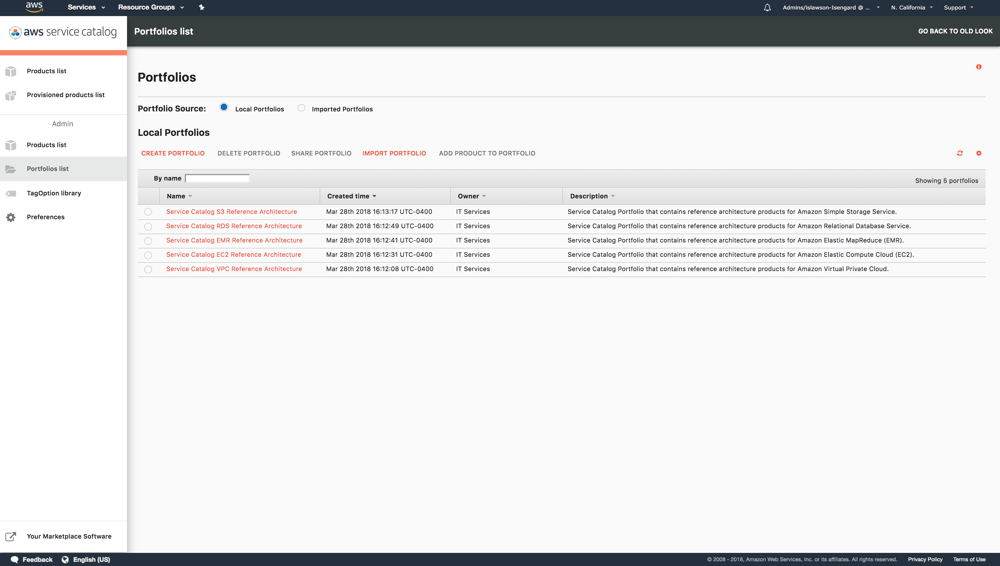

Copyright 2018 Amazon.com, Inc. or its affiliates. All Rights Reserved.
  
  Licensed under the Apache License, Version 2.0 (the "License").
  You may not use this file except in compliance with the License.
  A copy of the License is located at
  
      http://www.apache.org/licenses/LICENSE-2.0
  
  or in the "license" file accompanying this file. This file is distributed 
  on an "AS IS" BASIS, WITHOUT WARRANTIES OR CONDITIONS OF ANY KIND, either 
  express or implied. See the License for the specific language governing 
  permissions and limitations under the License.

# AWS Service Catalog Reference Architectures

AWS Service Catalog allows you to centrally manage these commonly deployed IT services, and helps you achieve consistent governance and meet your compliance requirements, while enabling users to quickly deploy only the approved IT services they need.

As an organization you can leverage AWS Service Catalog to create and manage catalogs of IT services that are approved for use on AWS. Many organizations are looking for sample products that they can distribute to their IAM users for a specific use-case. The Service Catalog Reference architectures are sample products distributed via this GitHub repository that demonstrate specific use-cases around specific AWS Services. 

To give you an example, the Amazon EC2 use case shows how an organization can leverage Service Catalog to provide Amazon Elastic Compute (EC2) instances and AWS Systems Manager (SSM)-based patching for testing and integration. Currently GitHub repository contains following reference architectures: 
 1. Virtual Private Cloud (VPC)
 2. Elastic Compute Cloud (EC2)
 3. Simple Storage Service (S3)
 4. Relational Database Service (RDS)
 5. Elastic MapReduce (EMR).  

Note - Before you distribute the CloudFormation template to your organization, review the template and ensure that it is doing what you want it to do. Check IAM permissions, Deletion policies, update stack behavior, and other aspects of the template and ensure that they are as per your expectations. These CloudFormation templates may need updates before you can use them in production.

## Getting Started

When implemented this reference architecture creates a Service Catalog Portfolio called "Service Catalog XXX Reference Architecture" with one associated product.  The Service Catalog Products reference cloudformation templates for corresponding service which can be lauched by end users through Service Catalog.    

### Service Catalog Portfolios

AWS Service Catalog portfolios will be created for each of the reference architectues.  These portfolios contain the Service Catalog products created from the cloudformation templates provided for each service.  Portfolios can be administered to include the management of users, application of constraints, tagging of portfolios and products, and the sharing of porfolios and products with other accounts.



### Service Catalog Product Launch

Once access has been provided to one or more end users, the reference architecture product can be lauched.  To lauch a reference architecture product the user needs to log into AWS Service Catalog, select the Reference Architecture Product and click launch.  The launch process will ask the end user for various input parameters.  After the form fields are filled out and the product is launched Service Catalog will execute the corresponding CloudFormation Template and create a stack. It will also display the output identified by the stack.  


### How to set up Service Catalog Reference architecture products and portfolios?

### Pre-requisites

1. Installation and configuration of the AWS Command Line Interface (CLI).  It is important to ensure that the AWS CLI configuration contains the correct target region as this region will be used to create the reference architecture components within Service Catalog.

    Instructions on installing and configurating the AWS Command Line Interface can be found on the AWS website at: https://aws.amazon.com/cli/

2. Access to a system with permission to execute a python script. The script utilizes "boto3" and "random" modules.

    Instructions on installing and configuring the boto3 python module can be found in the Boto 3 quickstart documentation at: http://boto3.readthedocs.io/en/latest/guide/quickstart.html

### Assumptions

* AWS Service Catalog has been enbaled in the target region.
* An AWS Service Catalog Admin account with attached "**AWSServiceCatalogAdminFullAccess**" managed policy has been created.
* An AWS Service Catalog Admin account with attached "**AWSServiceCatalogEndUserFullAccess**" managed policy has been created.

### Installion - Overview

1. Using your terminal, clone the reference architecture from Github into a folder.
2. Contents will include directories for the following:
    * ./vpc 
    * ./ec2
    * ./s3
    * ./rds
    * ./emr
3. Navigate to the folder corresponding to the reference architecture you wish to distribute via AWS Service Catalog
4. Review AWS Region you are currently in.
5. Execute the python setup script.

### Installation -  Step-By-Step instructions
Here is the list of commands to be executed from terminal - 
```text
### Download reference architecture
mkdir ~/Downloads/sc-ra
cd ~/Downloads/sc-ra
git clone https://github.com/aws-samples/aws-service-catalog-reference-architectures       

### Change to appropriate Reference Architecture directory, these instructions show how to create VPC Service Catalog product. However instructions remain same for all reference architecture modules.
cd vpc      

### You can execute ls -l if you are using linux terminal to see files available.
ls -l
-rw-r--r--  1 username  staff   7873 Mar 12 16:07 README.md
-rwxr-xr-x  1 username  staff   3358 Mar 12 15:19 sc-vpc-ra-setup.py
-rw-r--r--  1 username  staff  31408 Mar 12 16:10 sc-vpc-ra.json
-rw-r--r--  1 username  staff  15265 Mar 12 16:00 sc-vpc-ra.yml
-rw-r--r--  1 username  staff 360954 Mar 12 17:53 sc-vpc-ra-architecture-multi-az.png

### Set execute permissions on python setup script
chmod +x sc-vpc-ra-setup.py 

### Verify whether your CLI is configured for appropraite region. Note that the script will create an AWS Service Catalog product along with corresponding portfolio. 
cat ~/.aws/config
[default]
region = us-east-2

### Execute the setup script 
./sc-vpc-ra-setup.py 
```

### Service Catalog Portfolio Access

Setup script creates an AWS Service Catalog Portfolio with a new product associated in the specified region.  Before these products can be launched, access needs to be granted to the portfolio to the service catalog admin and end users.To grant access:

1. Open the AWS Console in a browser window.
2. Select the Services dropdown from the upper left and navigate to the Service Catalog to open the Service Catalog management page.
3. Select the portfolio called "Service Catalog XXX Reference Architecture" to open the specific portfolio management page.
4. Expand the option for User, groups and roles and click "ADD USER, GROUP OR ROLE" which will open an access management page.  Select the specific users, groups and roles that you want to provide access to and choose "ADD ACCESS".


### Reference Architecture Cleanup instructions

Perform following steps to remove a Reference Architecture from Service Catalog:

1. Terminate all Service Catalog Reference Architecture provisioned products corresponding to your product.
2. Remove all products from the portfolio.
3. Remove all constraints from the portfolio.**
3. Remove all access to users, groups and roles from the portfolio.
4. Remove all shares associated with the portfolio.**
4. Remove all tags from the portfolio.
5. Remove all tagOptions from the portfolio.**
5. Delete all products from Service Catalog.
5. Delete the porfolio from Service Catalog.


## License

* This project is licensed under the Apache 2.0 license - see the [LICENSE](LICENSE) file for details

## Authors

* Israel Lawson - AWS Sr. Solutions Architect - Initial work

## Acknowledgments

The following AWS team members have provided guidance, code review and other assistance throughout the design of this reference architecture.

* David Aiken - AWS Solutions Architect Manager
* Mahdi - Service Calalog Business Development
* Phil Chen - AWS Sr. Solutions Architect
* Kanchan Waikar - AWS Solutions Architect
* Kenneth Walsh - AWS Solutions Architect
