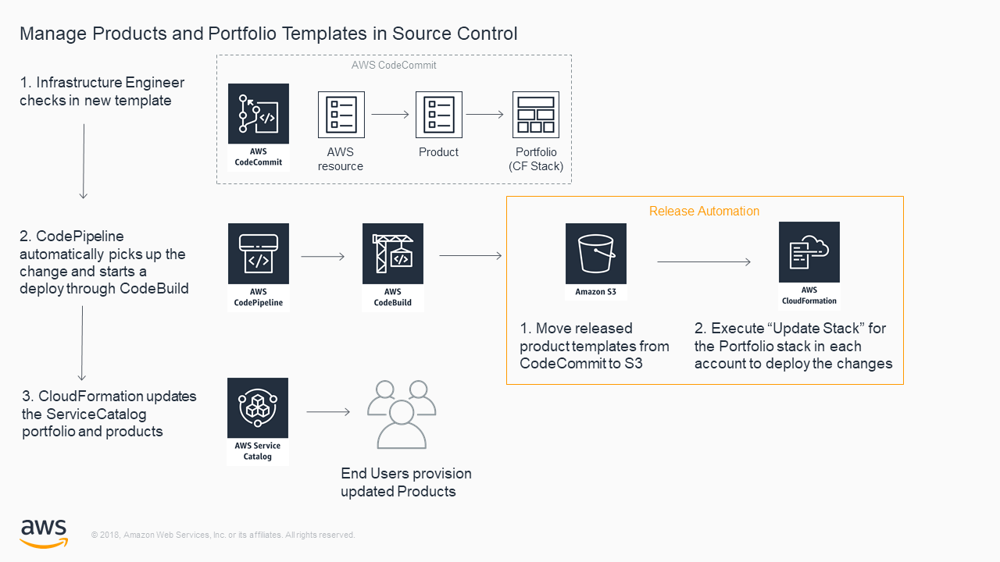

# AWS Service Catalog CodePipeline Automation Reference blueprint

This reference blueprint demonstrates how an organization can leverage CodePipeline to automate the management and deployment of Serivce Catalog Portfolios, Products, and Resources.

## Getting Started

When implemented this reference blueprint creates an AWS CodeCommit Repo, CodePipeline, and CodeBuild. 
This pipeline will allow infrastructrue engineers to use Infrastructure as Code (IaC) to mange the Portfolios and Products in ServiceCatalog.
Updating a ServiceCatalog Product becomes as easy as ```git push```


[](https://console.aws.amazon.com/cloudformation/home?region=us-east-1#/stacks/new?stackName=SC-RA-IACPipeline&templateURL=https://s3.amazonaws.com/aws-service-catalog-reference-architectures/codepipeline/sc-codepipeline-ra.json)  
[https://s3.amazonaws.com/aws-service-catalog-reference-architectures/codepipeline/sc-codepipeline-ra.json](https://s3.amazonaws.com/aws-service-catalog-reference-architectures/codepipeline/sc-codepipeline-ra.json)


### Install from your own S3 bucket  
1. clone this git repo:  
  ```git clone git@github.com:aws-samples/aws-service-catalog-reference-architectures.git```  
2. Copy everything in the repo to an S3 bucket:  
  ```cd aws-service-catalog-reference-architectures```  
  ```aws s3 cp . s3://[YOUR-BUCKET-NAME-HERE] --exclude "*" --include "*.json" --include "*.yml" --recursive```  
3. In the AWS [CloudFormation console](https://console.aws.amazon.com/cloudformation) choose "Create Stack" and supply the CodePipeline S3 url:  
  ```https://s3.amazonaws.com/[YOUR-BUCKET-NAME-HERE]/codepipeline/sc-codepipeline-ra.json```  

create the codecommit user
create the launchrole
create the portfolio stackset

https://docs.aws.amazon.com/AWSCloudFormation/latest/UserGuide/stacksets-prereqs.html
https://s3.amazonaws.com/cloudformation-stackset-sample-templates-us-east-1/AWSCloudFormationStackSetAdministrationRole.yml
https://s3.amazonaws.com/cloudformation-stackset-sample-templates-us-east-1/AWSCloudFormationStackSetExecutionRole.yml

  
  

### CodePipeline to automatically update ServiceCatalog when templates are checked into CodeCommit  



