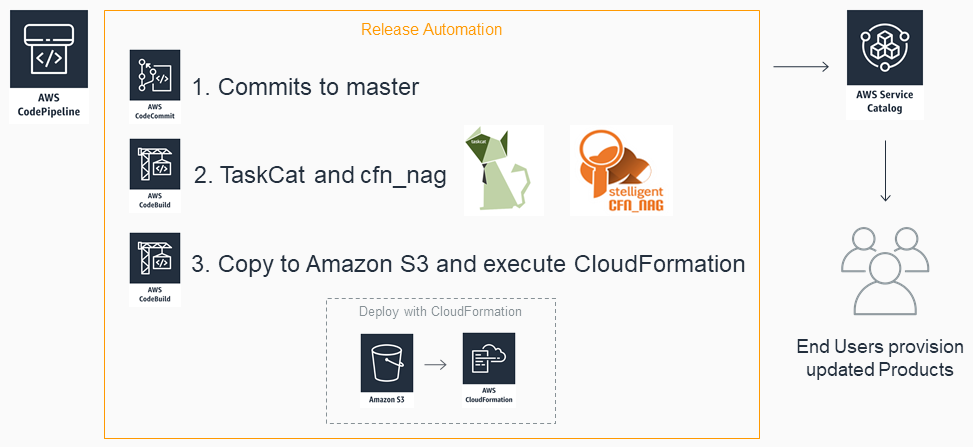

# AWS Service Catalog CodePipeline Automation Reference architecture

This reference architecture creates an AWS CodeCommit Repo, CodePipeline, and CodeBuild.
 This pipeline will allow infrastructrue engineers to use Infrastructure as Code (IaC) to mange the Portfolios and Products
 across multiple accounts and regions in ServiceCatalog.  The pipeline includes sample template validation and cfn_nag stages.
 Updating a ServiceCatalog becomes as easy as ```git push```


## Setup for Single Account
1. Create the Automated pipeline  
  [](https://console.aws.amazon.com/cloudformation#/stacks/new?stackName=SC-RA-IACPipeline&templateURL=https://s3.amazonaws.com/aws-service-catalog-reference-architectures/codepipeline/sc-codepipeline-ra.json)  
  https://s3.amazonaws.com/aws-service-catalog-reference-architectures/codepipeline/sc-codepipeline-ra.json

2. Create the Portfolio  
  [](https://console.aws.amazon.com/cloudformation#/stacks/new?stackName=SC-IAC-automated-portfolio&templateURL=https://s3.amazonaws.com/aws-service-catalog-reference-architectures/ec2/sc-portfolio-ec2demo.json)  
  https://s3.amazonaws.com/aws-service-catalog-reference-architectures/ec2/sc-portfolio-ec2demo.json

3. Follow the usage directions [below](#using-the-automated-codepipeline) 
  Additionaly, before your first push you must also change the buildspec.yaml:  
  remove the last 2 commands lines which start with "aws cloudformation update-stack-set ..."  
  add line ```- /bin/bash codepipeline/run-cloudformationupdate.sh```  


 
## Multi-Account Setup
For a multi-account multi-region setup you must choose a hub account and central region.
 The IAM roles will be launched once in the central region in each account while the Portfolio templates will be launched
 in each region within each account. CloudFormation StackSets will be used to distribute stacks across accounts and regions. You may deploy Stacks using StackSets to specific accounts
 or to an AWS Organization OU. For more information aabout CloudFormation StackSets review the [user guide](https://docs.aws.amazon.com/AWSCloudFormation/latest/UserGuide/stacksets-prereqs.html).  

The hub account id is needed to create the trust relationship in each spoke account so the hub may execute CloudFormation in the spoke accounts. 
 If ServiceCatalog will be deployed to the hub account, then you must also create the execution role in the hub account with the hub account id.
 Your Account ID from the AWS cli it is the Account variable from the following command:  
 ```aws sts get-caller-identity```

### Express Setup using bash script
1. Launch the StackSet Execution roles in each spoke account with the hub account's ID (Optional, for multi-account only)  
   [](https://console.aws.amazon.com/cloudformation#/stacks/new?stackName=IAM-StackSetExecution&templateURL=https://s3.amazonaws.com/cloudformation-stackset-sample-templates-us-east-1/AWSCloudFormationStackSetExecutionRole.yml)  
   https://s3.amazonaws.com/cloudformation-stackset-sample-templates-us-east-1/AWSCloudFormationStackSetExecutionRole.yml  
2. Setup AWS cli config for your hub account. 
3. Run the install.sh script
   * for multi-account change the ```childAcc=""``` parameter in install.sh to a space delimited list for the spoke acocunts (DO NOT include the hub account here) such as:   
   ```childAcc="1234567890 0987654321"```
   * windows users will need the Windows Subsystem for Linux installed.  Or, you can run this from an AWS Linux EC2 instance.


### Manual Setup using console
1. Create the Automated pipeline in your hub account  
  [](https://console.aws.amazon.com/cloudformation#/stacks/new?stackName=SC-RA-IACPipeline&templateURL=https://s3.amazonaws.com/aws-service-catalog-reference-architectures/codepipeline/sc-codepipeline-ra.json)  
  [https://s3.amazonaws.com/aws-service-catalog-reference-architectures/codepipeline/sc-codepipeline-ra.json](https://s3.amazonaws.com/aws-service-catalog-reference-architectures/codepipeline/sc-codepipeline-ra.json)

2. Create the StackSet Admin role in the hub account.  
  Run once in the hub account.  
  [](https://console.aws.amazon.com/cloudformation#/stacks/new?stackName=IAM-StackSetAdministrator&templateURL=https://s3.amazonaws.com/cloudformation-stackset-sample-templates-us-east-1/AWSCloudFormationStackSetAdministrationRole.yml)  
  https://s3.amazonaws.com/cloudformation-stackset-sample-templates-us-east-1/AWSCloudFormationStackSetAdministrationRole.yml  
  
3. Create the StackSet Execution roles in the hub account and any spoke account.    
  Run once in each spoke account and the hub if you wish to use ServiceCatalog from the hub.  
  [](https://console.aws.amazon.com/cloudformation#/stacks/new?stackName=IAM-StackSetExecution&templateURL=https://s3.amazonaws.com/cloudformation-stackset-sample-templates-us-east-1/AWSCloudFormationStackSetExecutionRole.yml)  
  https://s3.amazonaws.com/cloudformation-stackset-sample-templates-us-east-1/AWSCloudFormationStackSetExecutionRole.yml

4. Launch the ServiceCatalog IAM StackSet into each spoke account from the hub account in [CloudFormation StackSet Console](https://console.aws.amazon.com/cloudformation).  
  a. make sure you are logged in to the hub account.  
  b. Template Source - Amazon S3 URL: https://s3.amazonaws.com/aws-service-catalog-reference-architectures/iam/sc-demosetup-iam.json  
  c. StackSet Name: SC-IAC-automated-IAMroles  
  d. If you copied this Repo to your own S3 bucket then supply it in the _RepoRootURL_ value, otherwise leave the default.  
  e. Include each spoke account ID.  The Hub account may also be a spoke account if you wish to use ServiceCatalog from the hub.  
  f. Deploy to only 1 region - this guide assumes us-east-1  

5. Launch the Portfolio StackSet from the hub account.  
  a. Template Source - Amazon S3 URL: https://s3.amazonaws.com/aws-service-catalog-reference-architectures/ec2/sc-portfolio-ec2VPC.json  
  c. StackSet Name: SC-IAC-automated-portfolio  
  d. If you copied this Repo to your own S3 bucket then supply it in the _RepoRootURL_ value, otherwise leave the default.  
  e. Include each spoke account ID.  The Hub account may also be a spoke account if you wish to use ServiceCatalog from the hub.  
  f. Deploy to any regions in which you want to use ServiceCatalog - this guide assumes us-east-1,us-east-2,us-west-1  

## Using The Automated CodePipeline  


  
1. Copy this Repo into your new CodeCommit Repo.  
  You will need a codecommit user. You can use an existing user or create a new one with the supplied template. Pick either HTTPS or SSH for connecting.
    -Sample CodeCommit user template: [iam/sc-codecommit-iamuser.yml](../iam/sc-codecommit-iamuser.yml)  
	-[Setting up HTTPS](https://docs.aws.amazon.com/codecommit/latest/userguide/setting-up-gc.html)
    -[Setting up ssh](https://docs.aws.amazon.com/codecommit/latest/userguide/setting-up-ssh-unixes.html)  
  The repo clone address is the **CloneUrlSsh** output variable from the SC-RA-IACPipeline CloudFormation Stack
  ```
  git clone git@github.com:aws-service-catalog-reference-architectures.git
  git clone https://YOUR-USERNAME@YOUR-REPO-NAME
  cp -r aws-service-catalog-reference-architectures/* SCPortfoliosRepo/
  cd SCPortfoliosRepo
  ```

2. Optionally edit the supplied config files for CodePipeline and [TaskCat](https://aws-quickstart.github.io/auto-testing.html) validation  
  If you fill in the provided TaskCat parameter files with values from your account,
  then you can have TaskCat validate the ServiceCatalog products in each account and region.
  
3. Commit the changes to your CodeCommit Repo and push!  
  You can follow the automated process in CodePipeline and Cloudformation.


