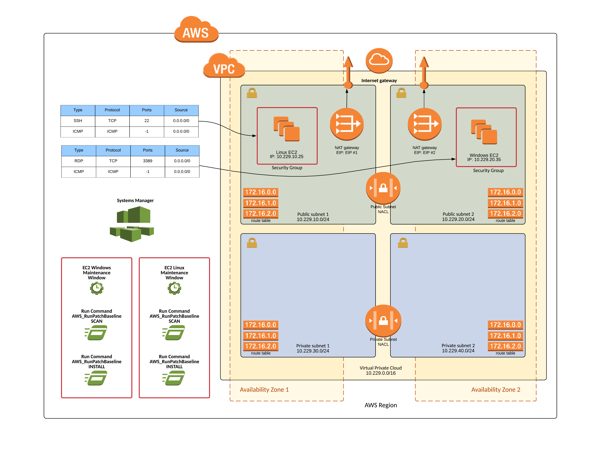

# Service Catalog EC2 Reference Architecture

This reference architecture demonstrates how an organization can leverage Serivce Catalog to provide Amazon Elastic Compute (EC2) instances and Simple Systems Manager (SSM) instance patching for testing and integration.

## Getting Started

When implemented this reference architecture creates a Service Catalog Portfolio called "Service Catalog EC2 Reference Architecture" with two associated products.  The Service Catalog Product references cloudformation templates for the Amazon EC2 Linux and Windows instances which can be lauched by end users through Service Catalog.  The Service Catalog EC2 product creates either an Aamzon Linux or Microsoft Windows EC2 instance in the VPC and Subnets selected by the end user.  A Amazon Simple Systems Manager patch baseline, maintenance window and task are created to allow for automated patching of the Aamzon Linux and Microsoft Windows operating systems.

### EC2 Architecture with Amazon Linux and Microsoft Windows instances



### Prerequisites

The following prerequisites are required:

1. Installation and configuration of the AWS Command Line Interface (CLI).  It is important to ensure that the AWS CLI configuration contains the correct target region as this region will be used to create the reference architecture components within Service Catalog.

    Instructions on installing and configurating the AWS Command Line Interface can be found on the AWS website at: https://aws.amazon.com/cli/

2. Access to a system with permission to execute a python script. The script utilizes modules for "boto3" and "random".

    Instructions on installing and configuring the boto3 python module can be found in the Boto 3 quickstart documentation at: http://boto3.readthedocs.io/en/latest/guide/quickstart.html

### Assumptions

* A Service Catalog has been enbaled in the target region.
* A Service Catalog Admin account has been created and assigned the "**AWSServiceCatalogAdminFullAccess**" IAM permission.
* A Service Catalog EndUser account has been created and assigned the "**AWSServiceCatalogEndUserFullAccess**" IAM permission.

### Installion Overview

1. Download the reference architecture zip file from Github and expand its content into a folder.
2. Contents will include:
    * ./README.md (this file)
    * ./COPYING
    * ./LICENSE
    * ./NOTICE
    * ./sc-ec2-ra-setup.py (python script used during setup process)
    * ./sc-ec2-linux-ra.yml (EC2 Cloudformation Template in YAML)
    * ./sc-ec2-linux-ra.json (EC2 Cloudformation Template in JSON)
    * ./sc-ec2-windows-ra.yml (EC2 Cloudformation Template in YAML)
    * ./sc-ec2-windows-ra.json (EC2 Cloudformation Template in JSON)
    * ./sc-ec2-ra-architecture.png
3. Provide execute permissions to the python script.
4. Confirm AWS Region for deployment.
5. Execute the python setup script.

### Installation Step-By-Step

```text
### Download reference architecture
laptop:Downloads user_name$ mkdir ~/Downloads/sc-ra
laptop:Downloads user_name$ cd ~/Downloads/sc-ra
laptop:sc-ra user_name$ git clone https://github.com/aws-samples/aws-service-catalog-reference-architectures       

### Change to EC2 Reference Architecture directory
laptop:ec2 user_name$ cd ec2

### View Contents
laptop:ec2 user_name$ ls -l
-rw-r--r--  1 user_name  staff   11357 Mar 15 14:48 COPYING
-rw-r--r--  1 user_name  staff   11357 Mar 15 14:48 LICENSE
-rw-r--r--  1 user_name  staff     121 Mar 15 14:47 NOTICES
-rw-r--r--  1 user_name  staff    8413 Mar 28 12:58 README.md
-rw-r--r--  1 user_name  staff   17498 Mar 28 13:00 sc-ec2-linux-ra.json
-rw-r--r--  1 user_name  staff    8703 Mar 28 13:00 sc-ec2-linux-ra.yml
-rw-r--r--  1 user_name  staff  627452 Mar 28 13:47 sc-ec2-ra-architecture.png
-rwxr-xr-x  1 user_name  staff    5578 Mar 28 12:49 sc-ec2-ra-setup.py
-rw-r--r--  1 user_name  staff   17908 Mar 28 12:52 sc-ec2-windows-ra.json
-rw-r--r--  1 user_name  staff    9126 Mar 27 15:30 sc-ec2-windows-ra.yml

### Set execute permission on python setup script
laptop:ec2 user_name$ chmod +x sc-ec2-ra-setup.py 

### Verify default AWS Region (this will be used for deployment)
laptop:ec2 user_name$ cat ~/.aws/config
[default]
region = us-east-2

### Execute the setup script 
laptop:ec2 user_name$ ./sc-ec2-ra-setup.py 

STARTED -- Setup of Service Catalog EC2 Reference Architecture.

PORTFOLIO CREATED: Service Catalog EC2 Reference Architecture
--id=port-id
--arn=arn:aws:catalog:us-east-1:000000000000:portfolio/port-id

PRODUCT CREATED: Amazon Elastic Compute Cloud (EC2) Linux
PRODUCT/PORTFOLIO ASSOCIATED: AWS EC2 Linux
--id=prod-id

PRODUCT CREATED: Amazon Elastic Compute Cloud (EC2) Windows
PRODUCT/PORTFOLIO ASSOCIATED: AWS EC2
--id=prod-id

FINISHED -- Setup of Service Catalog EC2 Reference Architecture.
```

### Service Catalog Portfolio Access

Once the setup script has completed there will be a new service catalog portfolio with a new EC2 products associated in the specified region.  Before these products can be launched access needs to be granted to the portfolio for the service catalog admin and end users.

1. Open the AWS Console in a browser window.
2. Select the Services dropdown from the upper left and navigate to the Service Catalog to open the Service Catalog management page.
3. Select the portfolio called "Service Catalog EC2 Reference Architecture" to open the specific portfolio management page.
4. Expand the option for User, groups and roles and click "ADD USER, GROUP OR ROLE" which will open an access management page.  Select the specific users, groups and roles that you want to provide access to and click "ADD ACCESS".

### Service Catalog Product Launch

Once access has been provided to one or more end users the EC2 reference architecture products can be lauched.  To lauch a EC2 reference architecture product the user needs to log into Service Catalog, select the EC2 Reference Architecture Linux or Windows Product and click launch.  The launch process will ask the end user for various details about how the EC2 product will be configured.  After the form fields are filled out and the product is launched Service Catalog will execute a cloudformation stack to build the product and provide the EC2 details back to the end user.

### Service Catalog EC2 Reference Architecture Cleanup

To remove the EC2 Reference Architecture from Service Catalog perform the following steps:

1. Terminate all Service Catalog EC2 Reference Architecture provisioned products.
2. Remove all products from the portfolio.
3. Remove all constraints from the portfolio.**
3. Remove all access to users, groups and roles from the portfolio.
4. Remove all shares associated with the portfolio.**
4. Remove all tags from the portfolio.
5. Remove all tagOptions from the portfolio.**
5. Delete all products from Service Catalog.
5. Delete the porfolio from Service Catalog.

## Authors

* Israel Lawson - AWS Sr. Solutions Architect - Initial work

## License

* This project is licensed under the Apache 2.0 license - see the [LICENSE](LICENSE) file for details

## Acknowledgments

The following AWS team members have provided guidance, code review and other assistance throughout the design of this reference architecture.

* David Aiken - AWS Solutions Architect Manager
* Mahdi - Service Calalog Business Development
* Phil Chen - AWS Sr. Solutions Architect
* Kanchan Waikar - AWS Solutions Architect
* Kenneth Walsh - AWS Solutions Architect

## Changelog

### 1.0
* Initial documentation created
* Added: README.md
* Added: sc-ec2-ra.zip
* Added: sc-ec2-ra.yml   
* Added: sc-ec2-ra.json      
* Added: sc-ec2-ra-architecture.png   
* Added: sc-ec2-ra-setup.py         
* Added: LICENSE.md
* Added: COPYING
* Added: NOTICES
* Added: LICENSE

### 1.1
* Deleted: sc-ec2-ra.yml (splitting linux and windows into seperate CFTs)
* Deleted: sc-ec2-ra.json (splitting linux and windows into seperate CFTs) 
* Added: sc-ec2-linux-ra.yml
* Added: sc-ec2-linux-ra.json
* Added: sc-ec2-windows-ra.yml
* Added: sc-ec2-windows-ra.json
* Updated: documentation
* Updated: sc-ec2-ra-architecture.png
