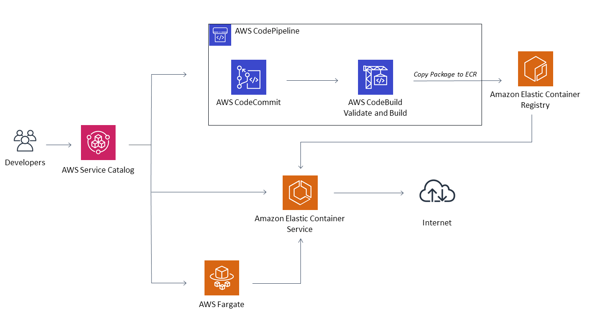

# AWS Service Catalog ECS Reference architecture

This reference architecture creates an AWS Service Catalog Portfolio called "Service Catalog Containers Reference Architecture"  
The Portfolio provides 3 products which will create a full DevOps deployment pipeline from code to container deployment in Fargate.  



1. Create the portfolio using the Launchstack: 
[](https://console.aws.amazon.com/cloudformation/#/stacks/new?stackName=SC-RA-ECS-Portfolio&templateURL=https://aws-service-catalog-reference-architectures.s3.amazonaws.com/ecs/sc-portfolio-ecs.json)  
2. Provision the cluster and codepipeline products from Service Catalog.  
3. The provisioned codepipeline product will create a new CodeCommit repo.  
	a. Add your code, docker file, and tests.  
    a. Adjust the skeleton builspecs in the codepipeline/ subfolder to fit your project tests and build commands.  
    b. Check-in the code to the new codecommit repo. CodePipeline will validate, build according to the buildspec files.  
	c. If all stages complete then CodePipeline will push the container to ECR.   
3. Once the container is in ECR you can provision the supplied Fargate Service product in Service Catalog.  
  This will create an ECS Service which is launched in the previously provisioned Fargate Cluster.  You may then view your new service using the ExternalUrl 
  output parameter from the ECS Cluster product.

Be aware, running this service as demonstrated here is non-SSL http.  In production you must protect all web traffic with SSL.  
The example templates here cannot create and manage SSL for you, so it must be done as an additional task in your account.

For more example ECS tamplates and to see the original source of the provided templates see this [repo](https://github.com/awslabs/aws-cloudformation-templates/tree/master/aws/services/ECS)

### Install from your own S3 bucket  
1. clone this git repo:  
  ```git clone git@github.com:aws-samples/aws-service-catalog-reference-architectures.git```  
2. Copy everything in the repo to an S3 bucket:  
  ```cd aws-service-catalog-reference-architectures```  
  ```aws s3 cp . s3://[YOUR-BUCKET-NAME-HERE] --exclude "*" --include "*.json" --include "*.yml" --recursive```  
3. In the AWS [CloudFormation console](https://console.aws.amazon.com/cloudformation) choose "Create Stack" and supply the Portfolio S3 url:  
  ```https://s3.amazonaws.com/[YOUR-BUCKET-NAME-HERE]/ecs/sc-portfolio-ecs.json```  
5. Set the _LinkedRole1_ and _LinkedRole2_ parameters to any additional end user roles you may want to link to the Portfolio.
6. Set the _CreateEndUsers_ parameter to No if you have already run a Portfolio stack from this repo (ServiceCatalogEndusers already exists).
7. Change the _RepoRootURL_ parameter to your bucket's root url:  
  ```https://s3.amazonaws.com/[YOUR-BUCKET-NAME-HERE]/``` 

