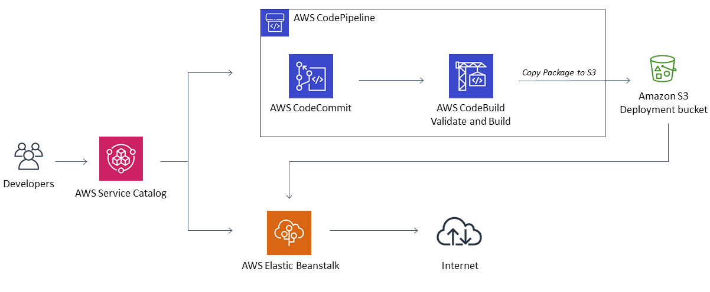

# AWS Service Catalog Elastic Beanstalk Reference architecture

This reference architecture creates an AWS Service Catalog Portfolio called "Service Catalog Elastic Beanstalk Reference Architecture" with one associated product. 
The Service Catalog product references a CloudFormation template that deploys a web application bundle to a new Elastic Beanstalk environment. 
The environment is a load balanced auto scaling cluaster. The template provides parameters for the user to control the autoscaling group.
To launch the environment, the user provides basic information such as the web application name, the name of the S3 bucket where the web application is stored, 
and the name of the Elastic Beanstalk solution stack that the application will run on. A list of available Solution Stacks can be found here:
https://docs.aws.amazon.com/elasticbeanstalk/latest/platforms/platforms-supported.html

Get a list of Solution Stacks from the AWS CLI with this command:  
```aws elasticbeanstalk list-available-solution-stacks```




[](https://www.youtube.com/watch?v=7y_vsmbjE_A&list=PLhr1KZpdzukcaA06WloeNmGlnM_f1LrdP)

See the blog about this solution:
[Standardizing CI/CD pipelines for .NET web applications with AWS Service Catalog](https://aws.amazon.com/blogs/devops/standardizing-cicd-pipelines-net-web-applications-aws-service-catalog/)


### Install  
Launch the Elastic Beanstalk portfolio stack:  
[](https://console.aws.amazon.com/cloudformation/home?region=us-east-1#/stacks/new?stackName=SC-RA-Beanstalk-Portfolio&templateURL=https://aws-service-catalog-reference-architectures.s3.amazonaws.com/elasticbeanstalk/sc-portfolio-elasticbeanstalk.json)

Be aware, running this service as demonstrated here is non-SSL http.  In production you must protect all web traffic with SSL.  
The example templates here cannot create and manage SSL for you, so it must be done as an additional task in your account.


