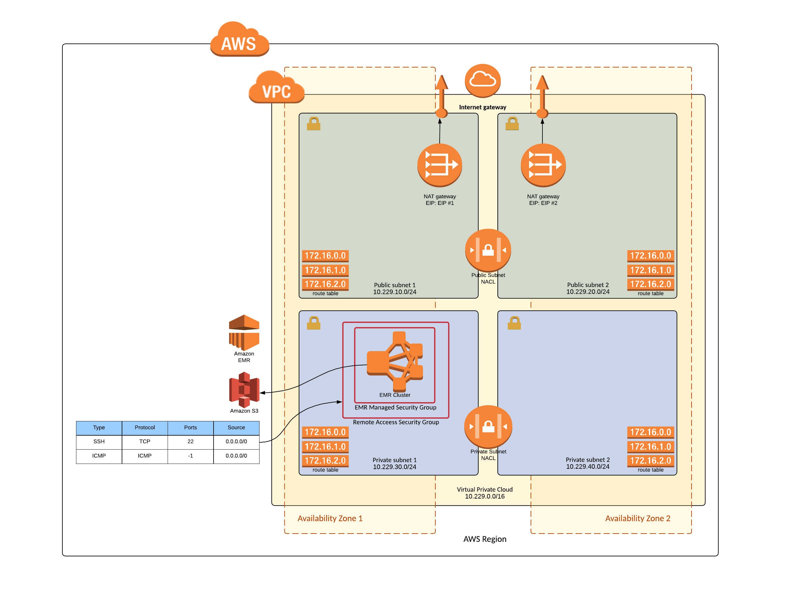

# Service Catalog EMR Reference Architecture

This reference architecture demonstrates how an organization can leverage Serivce Catalog to provide Amazon Elastic MapReduce (EMR) clusters for testing and integration.

## Getting Started

When implemented this reference architecture creates a Service Catalog Portfolio called "Service Catalog EMR Reference Architecture" with one associated product.  The Service Catalog Product references a cloudformation template for the Amazon EMR cluster which can be lauched by end users through Service Catalog.  The Service Catalog EMR product creates an Aamzon Elastic MapReduce cluster in the VPC and Subnets selected by the end user.  A remote access security group is also created to allow for a bastion host to connect to the instances used by EMR via SSH.

### Amazon Elastic MapReduce Cluster



### Prerequisites

The following prerequisites are required:

1. Installation and configuration of the AWS Command Line Interface (CLI).  It is important to ensure that the AWS CLI configuration contains the correct target region as this region will be used to create the reference architecture components within Service Catalog.

    Instructions on installing and configurating the AWS Command Line Interface can be found on the AWS website at: https://aws.amazon.com/cli/

2. Access to a system with permission to execute a python script. The script utilizes modules for "boto3" and "random".

    Instructions on installing and configuring the boto3 python module can be found in the Boto 3 quickstart documentation at: http://boto3.readthedocs.io/en/latest/guide/quickstart.html

### Assumptions

* A Service Catalog has been enbaled in the target region.
* A Service Catalog Admin account has been created and assigned the "**AWSServiceCatalogAdminFullAccess**" IAM permission.
* A Service Catalog EndUser account has been created and assigned the "**AWSServiceCatalogEndUserFullAccess**" IAM permission.

### Installion Overview

1. Download the reference architecture zip file from Github and expand its content into a folder.
2. Contents will include:
    * ./README.md (this file)
    * ./COPYING
    * ./LICENSE
    * ./NOTICES
    * ./sc-emr-ra-setup.py (python script used during setup process)
    * ./sc-emr-ra.yml (EMR Cloudformation Template in YAML)
    * ./sc-emr-ra.json (EMR Cloudformation Template in JSON)
    * ./sc-emr-ra-architecture.png
3. Provide execute permissions to the python script.
4. Confirm AWS Region for deployment.
5. Execute the python setup script.

### Installation Step-By-Step

```text
### Download reference architecture
laptop:Downloads islawson$ mkdir ~/Downloads/sc-emr-ra
laptop:Downloads islawson$ cd ~/Downloads/sc-emr-ra
laptop:sc-emr-ra islawson$ aws s3 cp s3://islawson-service-catalog-reference-architecture/emr/sc-emr-ra.zip ./
download: s3://islawson-service-catalog-reference-architecture/emr/sc-emr-ra.zip to ./sc-emr-ra.zip

### Unzip contents
laptop:sc-emr-ra islawson$ unzip sc-emr-ra.zip 
Archive:  sc-emr-ra.zip
  inflating: README.md 
  inflating: COPYING
  inflating: LICENSE
  inflating: NOTICES   
  inflating: sc-emr-ra.yml     
  inflating: sc-emr-ra.json 
  inflating: sc-emr-ra-architecture.png    
  inflating: sc-emr-ra-setup.py        

### View Contents
laptop:sc-emr-ra islawson$ ls -l
-rw-r--r--  1 islawson  staff  11357 Mar 26 08:54 COPYING
-rw-r--r--  1 islawson  staff  11357 Mar 26 08:54 LICENSE
-rw-r--r--  1 islawson  staff    121 Mar 26 08:54 NOTICES
-rw-r--r--  1 islawson  staff   7469 Mar 27 11:38 README.md
-rwxr-xr-x  1 islawson  staff   3860 Mar 27 11:34 sc-emr-ra-setup.py
-rw-r--r--  1 islawson  staff  10146 Mar 27 11:39 sc-emr-ra.json
-rw-r--r--  1 islawson  staff   5229 Mar 27 11:08 sc-emr-ra.yml

### Set execute permission on python setup script
laptop:sc-emr-ra islawson$ chmod +x sc-emr-ra-setup.py 

### Verify default AWS Region (this will be used for deployment)
laptop:sc-emr-ra islawson$ cat ~/.aws/config
[default]
region = us-east-2

### Execute the setup script 
laptop:sc-emr-ra islawson$ ./sc-emr-ra-setup.py 

STARTED -- Setup of Service Catalog EMR Reference Architecture.

PORTFOLIO CREATED: Service Catalog EMR Reference Architecture
--id=port-jr6olxti2pbqm
--arn=arn:aws:catalog:us-east-1:384053732253:portfolio/port-jr6olxti2pbqm

PRODUCT CREATED: Amazon Elastic MapReduce (EMR)
PRODUCT/PORTFOLIO ASSOCIATED: AWS EMR
--id=prod-547auyrzdem5y

FINISHED -- Setup of Service Catalog EMR Reference Architecture.
```

### Service Catalog Portfolio Access

Once the setup script has completed there will be a new service catalog portfolio with a new EMR product associated in the specified region.  Before these products can be launched access needs to be granted to the portfolio for the service catalog admin and end users.

1. Open the AWS Console in a browser window.
2. Select the Services dropdown from the upper left and navigate to the Service Catalog to open the Service Catalog management page.
3. Select the portfolio called "Service Catalog EMR Reference Architecture" to open the specific portfolio management page.
4. Expand the option for User, groups and roles and click "ADD USER, GROUP OR ROLE" which will open an access management page.  Select the specific users, groups and roles that you want to provide access to and click "ADD ACCESS".

### Service Catalog Product Launch

Once access has been provided to one or more end users the EMR reference architecture product can be lauched.  To lauch a EMR reference architecture product the user needs to log into Service Catalog, select the EMR Reference Architecture Product and click launch.  The launch process will ask the end user for various details about how the EMR product will be configured.  After the form fields are filled out and the product is launched Service Catalog will execute a cloudformation stack to build the product and provide the EMR details back to the end user.

### Service Catalog EC2 Reference Architecture Cleanup

To remove the EMR Reference Architecture from Service Catalog perform the following steps:

1. Terminate all Service Catalog EMR Reference Architecture provisioned products.
2. Remove all products from the portfolio.
3. Remove all constraints from the portfolio.**
3. Remove all access to users, groups and roles from the portfolio.
4. Remove all shares associated with the portfolio.**
4. Remove all tags from the portfolio.
5. Remove all tagOptions from the portfolio.**
5. Delete all products from Service Catalog.
5. Delete the porfolio from Service Catalog.

## Authors

* Israel Lawson - AWS Sr. Solutions Architect - Initial work

## License

* This project is licensed under the Apache 2.0 license - see the [LICENSE](LICENSE) file for details

## Acknowledgments

The following AWS team members have provided guidance, code review and other assistance throughout the design of this reference architecture.

* David Aiken - AWS Solutions Architect Manager
* Mahdi - Service Calalog Business Development
* Phil Chen - AWS Sr. Solutions Architect
* Kanchan Waikar - AWS Solutions Architect
* Kenneth Walsh - AWS Solutions Architect

## Changelog

### 1.0
* Initial documentation created
* Added: README.md
* Added: sc-emr-ra.zip
* Added: sc-emr-ra.yml   
* Added: sc-emr-ra.json      
* Added: sc-emr-ra-architecture.png   
* Added: sc-emr-ra-setup.py         
* Added: COPYING
* Added: NOTICES
* Added: LICENSE