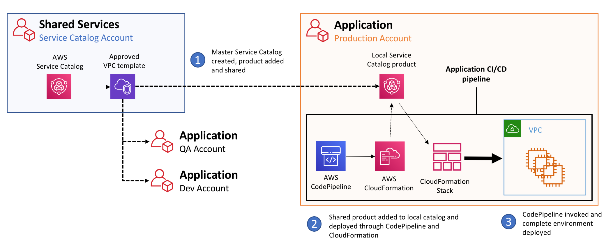
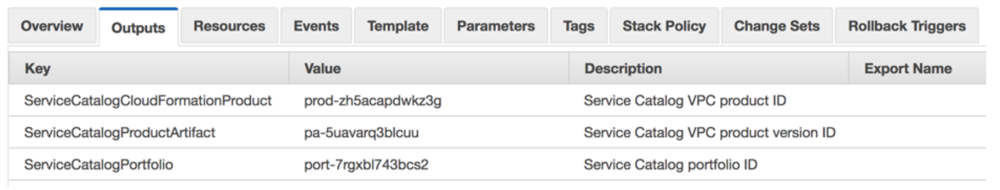
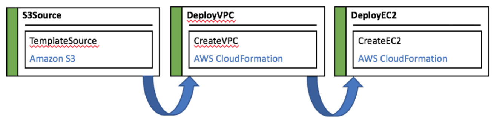
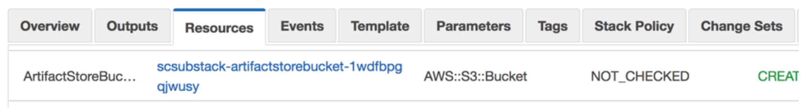
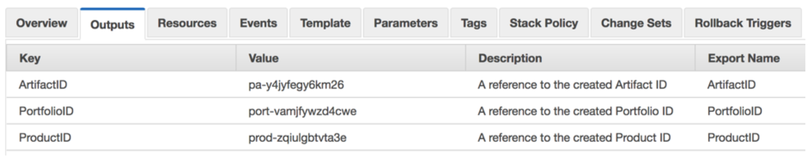

**Building a cross-account infrastructure delivery pipeline
using AWS Service Catalog**

A common security design pattern and best practice among many of our
enterprise customers is to provide application isolation through the
adoption of a multi-account strategy. Many customers choose to create
individual AWS accounts based on Software Development Life Cycle (SDLC)
phases such as Dev, QA, and Production, to provide complete separation
across environments. However, if application requirements are not be
fully understood at time of account creation, it can be difficult to
provision the necessary infrastructure components. Additionally, as more
accounts are created, customers are looking for a way to enforce
infrastructure compliance and consistency across these different
accounts.

This guide will show you how leveraging [AWS Service Catalog](https://docs.aws.amazon.com/servicecatalog/latest/adminguide/introduction.html) can help
address these challenges and enable developers to quickly, securely, and
easily deploy infrastructure components in any environment through a
CI/CD pipeline. We will demonstrate this by provisioning a Service
Catalog that hosts an approved VPC template in a Shared Services
account. This product will be shared with our application account,and
deployed using [AWS CodePipeline](https://aws.amazon.com/codepipeline/), which
will then deploy an EC2 instance into our newly built VPC.



**Preparation and Overview**

This post will walk you through the automated deployment and subsequent
testing of the environment using the following steps:

1.  Infrastructure account configuration

    1.  Build the Infrastructure account Service Catalog portfolio

    2.  Define a VPC product

    3.  Share the portfolio with the Application account

2.  Application account configuration

    4.  Create a local Service Catalog

    5.  Add the VPC product

    6.  Provision necessary IAM roles and launch constraints

    7.  Build a Code Pipeline to deploy an EC2 instance into a newly
        created VPC

3.  Application deployment pipeline testing

Note that in this walkthrough you will need 2 accounts, 1 to represent
the Shared Services account and a second to represent the Application
target account. [AWS CloudFormation](https://aws.amazon.com/cloudformation/)
templates have been provided to allow you to easily build each
environment.

This blog post assumes the user is familiar with the process of using
Service Catalog across multiple accounts. For more information, please
refer to:

[https://aws.amazon.com/blogs/mt/aws-service-catalog-hub-and-spoke-model-how-to-automate-the-deployment-and-management-of-service-catalog-to-many-accounts/](https://aws.amazon.com/blogs/mt/aws-service-catalog-hub-and-spoke-model-how-to-automate-the-deployment-and-management-of-service-catalog-to-many-accounts/)

**Shared Services account configuration**

Choose an account that will act as the Shared Services account. This is
the AWS account that will act as our Service Catalog hub. Login to the
Shared Service account and retrieve the account ID of our target
application account, using the AWS CLI command below:

`aws sts get-caller-identity`

**1. UPLOAD the service catalog product template**

First, we need to upload the [VPC template](master/VPC.yml) (located in the /master subdirectory in this repo) to a local S3 bucket. Within our Service Catalog, we will use this template to define the product that will be shared with our application account. Ensure that the Service Catalog service has read access to both the bucket and object.

**2. CREATE and share SERVICE catalog hub**

From the Shared Services account, deploy the CloudFormation template
below. This template will build our portfolio and populate it with a VPC
product, which will represent the secure, compliant network definition
we want to share with our application team.

Specify the account ID from above as the **SubAccountID** parameter and
the S3 bucket above as **ProductArtifactLocation**.

[](https://console.aws.amazon.com/cloudformation#/stacks/new?stackName=SCXacctPipelineMaster&templateURL=https://s3.amazonaws.com/aws-service-catalog-reference-architectures/xacct-pipeline/sc-master.yml)

Once the CloudFormation template has completed successfully, navigate to
the Stack Outputs tab and note the
**ServiceCatalogCloudFormationProduct**, **ServiceCatalogProductArtifact**, and **ServiceCatalogPortfolio** keys. We will use these values later, when we deploy our Application account
stack.



**Application account configuration**

We are now ready to configure our application account. In this account,
we will perform the following actions:

- Create a local Service Catalog

- Add the portfolio product shared from the Shared Services hub
    account

- Create the following supporting IAM roles

    - Service Catalog launch constraint role -- *SCLaunchConstraint*

    - Service Catalog CloudFormation Role -- *SCDemoCFNRole*

- Create an S3 bucket to host our CodePipeline artifact templates

- Create a CodePipeline to automate deployment of our VPC and EC2
    instance

Our pipeline uses 3 simple stages and consists of the following:

1.  A .zip file containing our source artifacts

    1.  A template which references our Service Catalog VPC product

    2.  A template defining a simple EC2 host which will be deployed
        into that VPC

2.  An S3 trigger which activates when the source artifact is uploaded
    to the S3 bucket

3.  Deployment steps which uses CloudFormation to deploy the following

    3.  Our shared VPC product

    4.  An EC2 instance into the public subnet

This workflow could also be modified to use [AWS CodeBuild](https://aws.amazon.com/codebuild/) and [AWS CodeDeploy](https://aws.amazon.com/codedeploy/) to build and deploy custom application code onto our EC2 instance. To keep things simple, however, we're going to limit the pipeline to the deployment of our infrastructure.

Before we execute the template, we need to retrieve some information
from our Shared Services account. The **PortfolioID**, **ProductID**,
and **ArtifactID** will be required to import the shared catalog and add
the appropriate product to our local catalog. Use the values shown in
the Outputs tab of the CloudFormation stack deployed within our Shared
Services account.

[](https://console.aws.amazon.com/cloudformation#/stacks/new?stackName=SCXacctPipelineApp&templateURL=https://s3.amazonaws.com/aws-service-catalog-reference-architectures/xacct-pipeline/sc-sub.yml)

When this is finished, we will have successfully created our code
pipeline within our target account. This pipeline can be invoked by
uploading our source artifact (our VPC and EC2 instance templates), into
our newly created S3 bucket.



**CI/CD Pipeline Deployment Testing**

To test our newly created pipeline, we're going to push our source zip
file, which contains our VPC and EC2 templates, to the S3 bucket created
above.

**1. Retrieve pipeline artifact source files**

First, retrieve the S3 source bucket name from the Resources tab of our
CloudFormation stack. It will be listed as "**ArtifactStoreBucket**".



Download the [scdemo.zip](sub/scdemo.zip) file from this Git repository.  We will upload this file to our S3 bucket to initiate the pipeline.

**2. INSPECT source templates**

Unzip this file and view the contents of the *CFN/DeployEC2.yml* and
*CFN/DeployVPC.yml* files in a text editor. No changes to either template
are required, and note that in *DeployEC2.yml* we are automatically
selecting the latest EC2 AMI ID from the AWS Systems Manager Parameter
Store service.

This process is described in greater detail in the link below:
[https://aws.amazon.com/blogs/compute/query-for-the-latest-amazon-linux-ami-ids-using-aws-systems-manager-parameter-store/](https://aws.amazon.com/blogs/compute/query-for-the-latest-amazon-linux-ami-ids-using-aws-systems-manager-parameter-store/)

Now from the root directory you used to unzip the file, re-zip the file:

`zip -r scblog.zip *`

**3. upload artifact to start pipeline**

Finally, copy scblog.zip to our S3 bucket and watch the pipeline
activate.

`aws s3 cp scdemo.zip s3://<bucket-name>`

The pipeline should activate once the S3 object has been detected. The
DeployVPC stage will reference the Service Catalog VPC product template,
*DeployVPC.yml* to build out our network. Afterwards, the DeployEC2
stage will invoke *DeployEC2.yml*, which will deploy a simple Linux
host.

From within our VPC template, we've used CloudFormation exports to
reference our previously deployed Service Catalog product. These can be
seen in the Outputs tab of the VPC stack created by our pipeline. Note
the **ArtifactID**, **PortfolioID**, and **ProductID** exports.



Opening up the *DeployVPC.yml* file will show that both the
**ProductID** and **ArtifactID** values are imported using the
!ImportValue intrinsic function.
```
Resources:
  VPC:
    Type: "AWS::ServiceCatalog::CloudFormationProvisionedProduct"
    Properties:
      # from aws servicecatalog search-products-as-admin
      ProductId: !ImportValue ProductID
      # from aws servicecatalog describe-product-as-admin --id
      ProvisioningArtifactId: !ImportValue ArtifactID
      ProvisioningParameters:
       - Key: "EnvironmentName"
         Value: !Ref EnvironmentName
```
We've used this same method to provide Subnet and Security Group
information to the EC2 instance template. In this case, however, the
exports were defined in the VPC template that was used to define the VPC
product in our master service catalog, and not in our VPC wrapper
template.

For more information on using CloudFormation exports to pass values
between stacks, please refer to:
[https://docs.aws.amazon.com/AWSCloudFormation/latest/UserGuide/using-cfn-stack-exports.html](https://docs.aws.amazon.com/AWSCloudFormation/latest/UserGuide/using-cfn-stack-exports.html)

That's it! We've successfully built a multi-account Service Catalog
pattern where products can be invoked directly from within the target
account's code pipeline.
