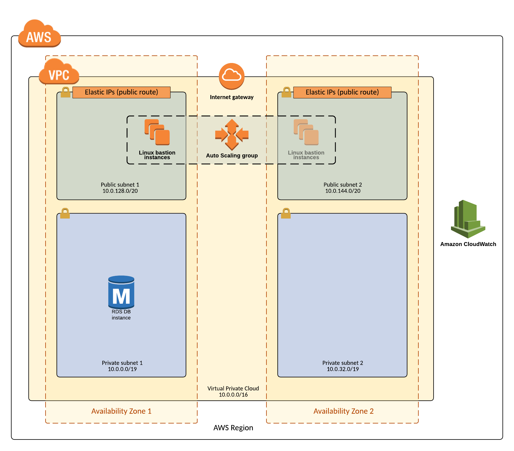
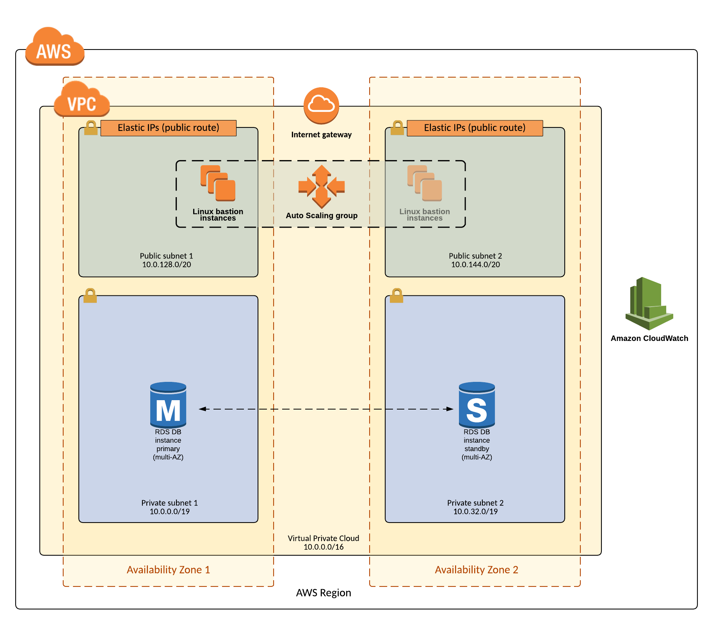

# AWS Service Catalog RDS Reference architecture

This reference architecture creates an AWS Service Catalog Portfolio called
 "AWS Service Catalog RDS Reference Architecture" with four associated products.
 The AWS Service Catalog Products reference RDS database cloudformation templates for
 PostgreSQL, MySQL, MariaDB, Microsoft SQL which can be launched by end users through AWS
 Service Catalog as either single instance databases or multi-availability zone databases.

### Install  
Launch the RDS portfolio stack:  

  
### Single Instance Architecture  

### Multi-Availability Zone Architecture  

