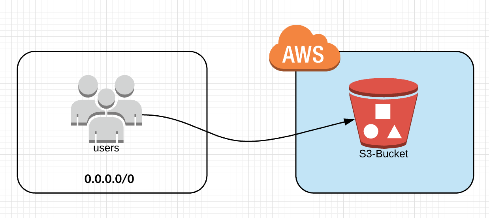
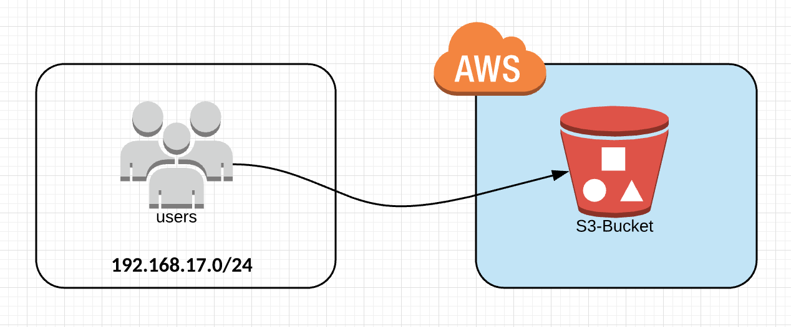
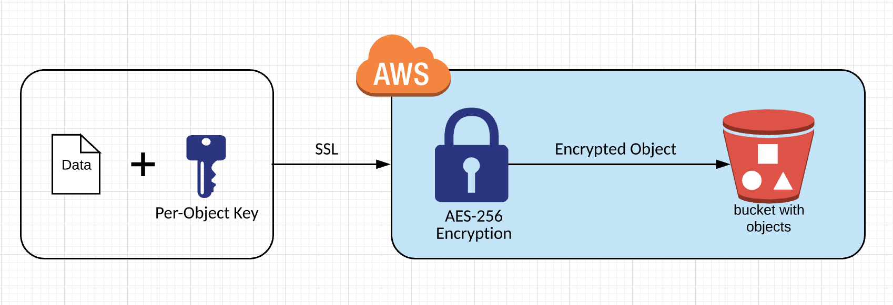
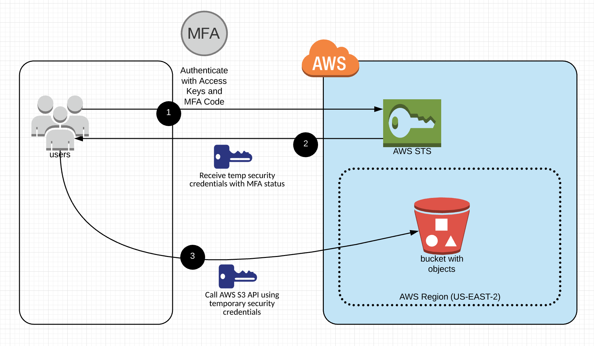
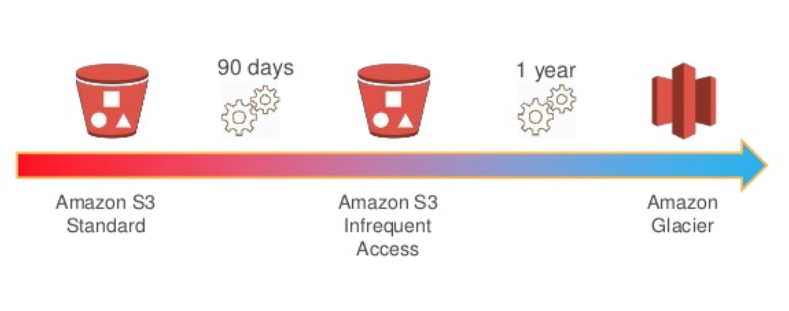

# AWS Service Catalog S3 Reference architecture

This reference architecture creates an AWS Service Catalog Portfolio called "Service Catalog S3 Reference Architecture"
 with five associated products. The AWS Service Catalog Product references cloudformation templates for the Amazon S3 buckets which
 can be lauched by end users through Service Catalog. The AWS Service Catalog S3 products create S3 buckets with varying 
 configurations:  
 1. Read-Only bucket with access from anywhere
 2. Private bucket with access restricted to a source CIDR block
 3. Private bucket with access requiring multi-factor authentication
 4. Private bucket with contents encrypted with S3 server side encryption
 5. Private bucket with a transition ruleset to migrate innactive objects to S3-IA and Glacier.  


### Install  
Launch the S3 portfolio stack:  
[](https://console.aws.amazon.com/cloudformation/home?region=us-east-1#/stacks/new?stackName=SC-RA-S3Portfolio&templateURL=https://s3.amazonaws.com/aws-service-catalog-reference-architectures/s3/sc-portfolio-s3.json)


### Install from your own S3 bucket  
1. clone this git repo:  
  ```git clone git@github.com:aws-samples/aws-service-catalog-reference-architectures.git```  
2. Copy everything in the repo to an S3 bucket:  
  ```cd aws-service-catalog-reference-architectures```  
  ```aws s3 cp . s3://[YOUR-BUCKET-NAME-HERE] --exclude "*" --include "*.json" --include "*.yml" --recursive```  
3. In the AWS [CloudFormation console](https://console.aws.amazon.com/cloudformation) choose "Create Stack" and supply the Portfolio S3 url:  
  ```https://s3.amazonaws.com/[YOUR-BUCKET-NAME-HERE]/s3/sc-portfolio-s3.json```  
4. Set the _LinkedRole1_ parameter to your _SCProvisioningRole_ name.
5. Change the "RepoRootURL" parameter to your bucket's root url:  
  ```https://s3.amazonaws.com/[YOUR-BUCKET-NAME-HERE]/```

 
### AWS S3 public Access read-only bucket



### AWS S3 private bucket with restricted access from source CIDR block



### AWS S3 Private SSE-S3 Encrypted Bucket



### AWS S3 Private MFA Restricted Access Bucket



### AWS S3 Private Bucket with transition policy for S3-IA and Glacier




