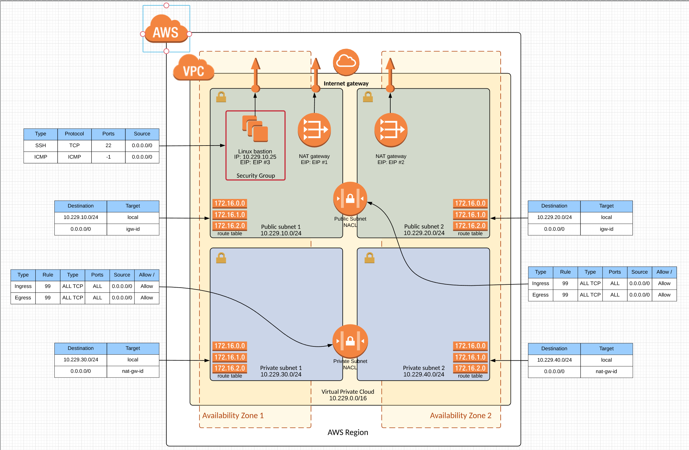

# Service Catalog VPC Reference Architecture

This reference architecture demonstrates how an organization can leverage AWS Service Catalog to provide Amazon Virtual Private Clouds (VPC) for testing and integration.  

## Getting Started

When implemented this reference architecture creates an AWS Service Catalog Portfolio called "Service Catalog VPC Reference Architecture" containing product.  The Service Catalog Products reference cloudformation templates for the Amazon VPC which can be lauched by end users through Service Catalog.  The product creates a VPC with two public and private subnets across two availability zones.  The VPC includes an Internet Gateway and a managed NAT Gateway in each public subnet as well as VPC Route Tables and Network ACLs that allow for communication between the public and private subnets.  Optionally, an Amazon Linux bastion instance and a Security Group can be deployed into the public subnet to allow for remote connectivity to the bastion instance.

### Multi-Availability Zone Architecture with Amazon Linux Bastion Instance



### Prerequisites

The following prerequisites are required:

1. Installation and configuration of the AWS Command Line Interface (CLI).  It is important to ensure that the AWS CLI configuration contains the correct target region as this region will be used to create the reference architecture components within Service Catalog.

    Instructions on installing and configurating the AWS Command Line Interface can be found on the AWS website at: https://aws.amazon.com/cli/

2. Access to a system with permission to execute a python script. The script utilizes "boto3" and "random" modules.

    Instructions on installing and configuring the boto3 python module can be found in the Boto 3 quickstart documentation at: http://boto3.readthedocs.io/en/latest/guide/quickstart.html

### Assumptions

* AWS Service Catalog has been enbaled in the target region.
* An AWS Service Catalog Admin account with attached "**AWSServiceCatalogAdminFullAccess**" managed policy has been created.
* An AWS Service Catalog Admin account with attached "**AWSServiceCatalogEndUserFullAccess**" managed policy has been created.

### Installion Overview

1. Clone the reference architecture from Github into a local directory.
2. Browse to the correct subdirectory.
4. Review AWS Region for creating your portfolio.
5. Execute the python setup script.

### Installation Step-By-Step
Here is the list of commands to be executed from terminal - 
```text
### Download reference architecture
mkdir ~/Downloads/sc-ra
cd ~/Downloads/sc-ra
git clone https://github.com/aws-samples/aws-service-catalog-reference-architectures       

### Change to appropriate Reference Architecture directory, For this test, choose vpc. However instructions remain same for all modules.
cd vpc      

### View Contents
ls -l
-rw-r--r--  1 username  staff   7873 Mar 12 16:07 README.md
-rwxr-xr-x  1 username  staff   3358 Mar 12 15:19 sc-vpc-ra-setup.py
-rw-r--r--  1 username  staff  31408 Mar 12 16:10 sc-vpc-ra.json
-rw-r--r--  1 username  staff  15265 Mar 12 16:00 sc-vpc-ra.yml
-rw-r--r--  1 username  staff 360954 Mar 12 17:53 sc-vpc-ra-architecture-multi-az.png

### Set execute permission on python setup script
chmod +x sc-vpc-ra-setup.py 

### Verify default AWS Region (this will be used for deployment)
cat ~/.aws/config
[default]
region = us-east-2

### Execute the setup script 
./sc-vpc-ra-setup.py 
### Log of the execute is printed here.

```

### Service Catalog Portfolio Access

Setup script will create an AWS Service Catalog Portfolio with a new VPC product associated in the specified region.  Before these products can be launched access needs to be granted to the portfolio for the service catalog admin and end users.

1. Open the AWS Console in a browser window.
2. Select the Services dropdown from the upper left and navigate to the Service Catalog to open the Service Catalog management page.
3. Select the portfolio called "Service Catalog VPC Reference Architecture" to open the specific portfolio management page.
4. Expand the option for User, groups and roles and click "ADD USER, GROUP OR ROLE" which will open an access management page.  Select the specific users, groups and roles that you want to provide access to and click "ADD ACCESS".

### Service Catalog Product Launch

Once access has been provided to one or more end users the VPC reference architecture product can be lauched.  To lauch a VPC reference architecture product the user needs to log into Service Catalog, select the VPC Reference Architecture Product and click launch.  The launch process will ask the end user for various details about how the VPC product will be configured.  After the form fields are filled out and the product is launched Service Catalog will execute a cloudformation stack to build the product and provide the VPC details back to the end user.

### Service Catalog VPC Reference Architecture Cleanup

To remove the VPC Reference Architecture from Service Catalog perform the following steps:

1. Terminate all Service Catalog VPC Reference Architecture provisioned products.
2. Remove all products from the portfolio.
3. Remove all constraints from the portfolio.**
3. Remove all access to users, groups and roles from the portfolio.
4. Remove all shares associated with the portfolio.**
4. Remove all tags from the portfolio.
5. Remove all tagOptions from the portfolio.**
5. Delete all products from Service Catalog.
5. Delete the porfolio from Service Catalog.

## Authors

* Israel Lawson - AWS Sr. Solutions Architect - Initial work

## License

* This project is licensed under the Apache 2.0 license - see the [LICENSE](LICENSE) file for details

## Acknowledgments

The following AWS team members have provided guidance, code review and other assistance throughout the design of this reference architecture.

* David Aiken - AWS Solutions Architect Manager
* Mahdi - Service Calalog Business Development
* Phil Chen - AWS Sr. Solutions Architect
* Kanchan Waikar - AWS Solutions Architect
* Kenneth Walsh - AWS Solutions Architect

## Changelog

### 1.0
* Initial documentation created
* Added: README.md
* Added: sc-vpc-ra.zip
* Added: sc-vpc-ra.yml   
* Added: sc-vpc-ra.json      
* Added: sc-vpc-ra-architecture-multi-az.png   
* Added: sc-vpc-ra-setup.py         
* Added: LICENSE.md